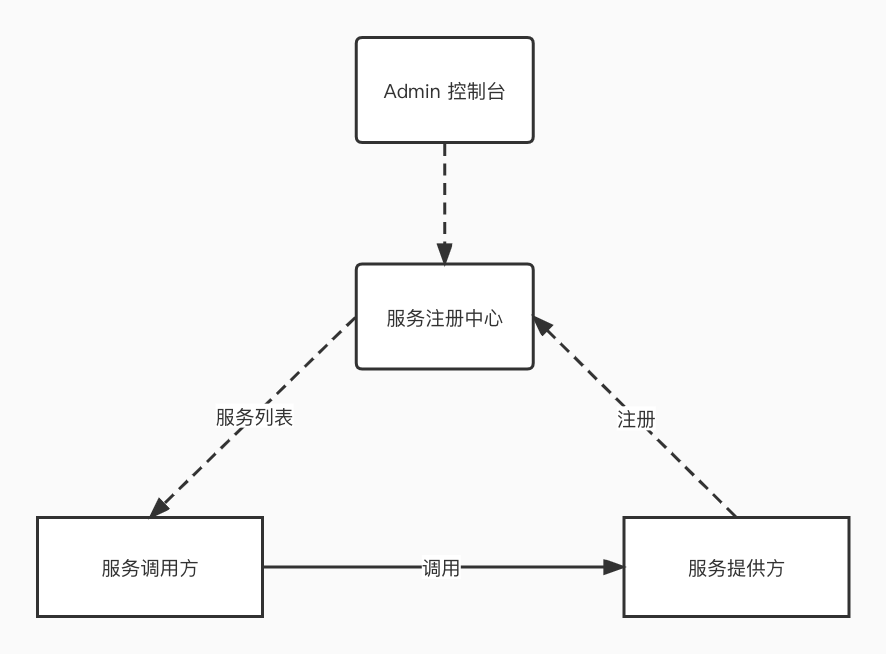

## Monica 服务治理平台

Monica 是一个集成动态服务发现、配置管理和服务管理的服务基础设施，帮助您快速实现动态服务发现、服务配置、服务元数据及流量管理。



### 快速开始

启动服务前先初始化 MySQL 数据库，建表脚本在 docs/monica_ddl.sql 中，DB 配置在 app.yaml 文件中。在 **dist** 目录中已经有 **admin-ui** 最新打包的页面，可以省去 nodejs 的环境安装：

```shell
go run main.go
```

服务启动后，默认运行在 1024 端口，可以修改 app.yaml 更改配置。

### 服务注册/发现

1.服务注册

```shell
curl --location --request POST 'http://127.0.0.1:1024/api/v1/register' \
--header 'Content-Type: application/json' \
--data '{
    "token": "18ee7064-3cdd-4ed5-a139-fd8d9add5847",
    "namespace": "Test",
    "service_name": "go_wallet_manage_svr",
    "node": {
      "ip": "127.0.0.1",
      "port": 1025,
      "weight": 100,
      "metadata": "[]"
    }
}'
```

2.服务更新

```shell
curl --location --request POST 'http://127.0.0.1:1024/api/v1/renew' \
--header 'Content-Type: application/json' \
--data '{
    "token": "18ee7064-3cdd-4ed5-a139-fd8d9add5847",
    "namespace": "Test",
    "service_name": "go_wallet_manage_svr",
    "ip": "127.0.0.1"
}'
```

3.服务注销

```shell
curl --location --request POST 'http://127.0.0.1:1024/api/v1/deregister' \
--header 'Content-Type: application/json' \
--data '{
    "token": "18ee7064-3cdd-4ed5-a139-fd8d9add5847",
    "namespace": "Test",
    "service_name": "go_wallet_manage_svr",
    "ip": "127.0.0.1"
}'
```

4.获取服务实例

```shell
curl --location --request GET 'http://127.0.0.1:1024/api/v1/fetch?ns=Test&sname=go_wallet_manage_svr'
```

Response:

```json
{
    "retcode": 0,
    "errmsg": "",
    "data": [
        {
            "ip": "127.0.0.1",
            "port": 1025,
            "weight": 100,
            "metadata": "[]"
        }
    ]
}
```

5.获取服务实例（长轮询）

```shell
curl --location --request GET 'http://127.0.0.1:1024/api/v1/poll?ns=Test&sname=go_wallet_manage_svr'
```

Response: 

```json
{
    "retcode": 0,
    "errmsg": "",
    "data": [
        {
            "ip": "127.0.0.1",
            "port": 1025,
            "weight": 100,
            "metadata": "[]"
        }
    ]
}
```

### 服务部署

1.编译 admin-ui

```shell
yarn install
yarn build
mv dist/ ../dist 
```

2.二进制包部署

```shell
go build -o monica
chmod +x restart.sh
./restart.sh
```

3.Docker 部署

```shell
# 编译镜像
docker build -t ccr.ccs.tencentyun.com/tcb-xxx-xupz/prod-xxx-online:[tag] .

# 推送镜像
docker push ccr.ccs.tencentyun.com/tcb-xxx-xupz/prod-xxxx-online:[tag]
```

### License

This project is licensed under the [Apache 2.0 license](https://github.com/ZuoFuhong/monica/blob/master/LICENSE).